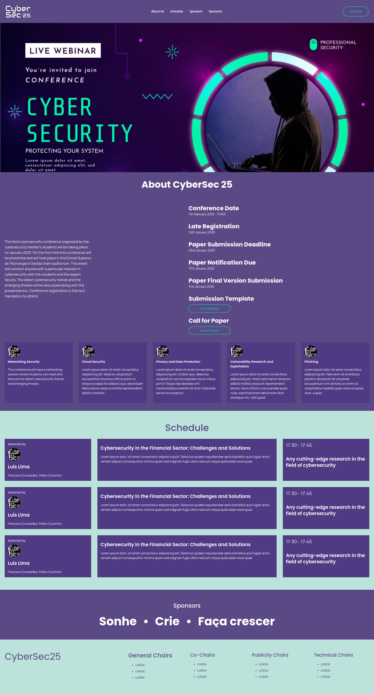

# CyberSec25 Conference - Official Website

This repository contains the official website for the conference organized by the students of the Cybersecurity Master's. The website is built with **HTML** and **TailwindCSS** and includes instructions for running in development mode and testing in production.

---

## Project Structure

```
├── src/
│   ├── images              # Images
│   ├── input.css           # Tailwind configuration file
│   ├── output.css          # Generated CSS file
│   └── index.html          # Main website page
└── README.md               # This file
└── tailwind.config.js      # Tailwind configuration file
```
---

## Open the Website

After downloading the repository, open the src/index.html file in your browser.

---

## Using TailwindCSS in Development

_If you're only using precompiled CSS without customization, you can skip this section_

**Prerequisites**
Ensure that **Node.js** is installed on your machine if you plan to use TailwindCSS for compiling and dynamically purging unused classes.

1.  **Install TailwindCSS**:
    If TailwindCSS is not already installed, you can set it up as a local dependency within the project directory:
    ```bash
        npm install -D tailwindcss
    ```

2. **Compile and Watch for Changes**:
    To compile and watch for changes to Tailwind classes, run:
    ```bash
        npx tailwindcss -i ./src/input.css -o ./src/output.css --watch
    ```

---

## Page Preview

